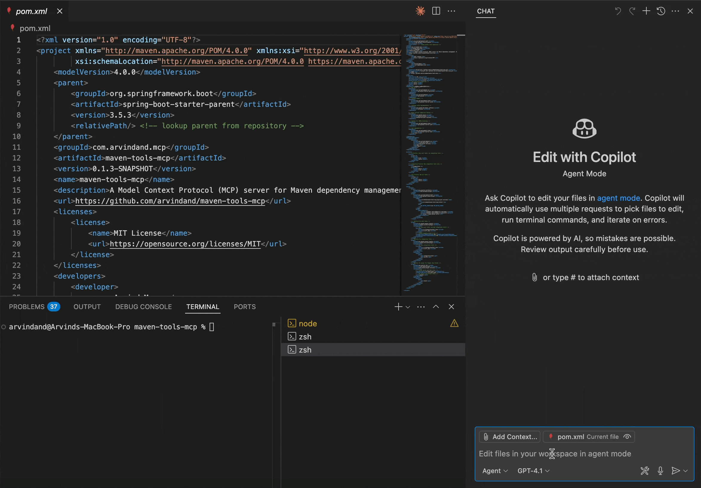

# Maven Tools MCP Server

[](https://openjdk.java.net/)
[](https://spring.io/projects/spring-boot)
[](https://modelcontextprotocol.io/)
[](LICENSE)
[](https://github.com/arvindand/maven-tools-mcp/releases)
[](https://hub.docker.com/r/arvindand/maven-tools-mcp)
[](https://hub.docker.com/r/arvindand/maven-tools-mcp)
[](https://github.com/arvindand/maven-tools-mcp/stargazers)

Dependency intelligence infrastructure for AI assistants and agents working with JVM projects.

## 🎯 Why This Exists

### The Developer Problem

Traditional upgrade workflow:

1. Google "Spring Boot 2.7 to 3.2 migration guide" (5 minutes)
2. Read 50-page migration docs, cross-reference breaking changes (15 minutes)
3. Check Maven Central for compatible dependency versions (5 minutes)
4. Update pom.xml, compile, fix breaking changes (30 minutes)
5. Debug mysterious runtime errors from incompatible transitive dependencies (2 hours)

**Total: ~3 hours, high error rate, production risks**

### The Solution

AI-powered workflow:

1. Ask your AI assistant: "Should I upgrade Spring Boot from 2.7.18 to 3.2.1? What will break?"
2. Get instant analysis + migration plan:
   - Latest stable: 3.2.1 available
   - Breaking changes: `javax.*` → `jakarta.*`, Hibernate 5→6, Security API changes
   - Compatible dependency versions provided
   - Step-by-step migration plan with code fixes
   - Documentation links for each breaking change

**Total: 30 seconds for complete plan, ~30 minutes for AI-assisted implementation vs 3+ hours manual**

### The AI Agent Opportunity

Traditional dependency bots (Renovate, Dependabot) can update version numbers but can't fix the code when APIs break.

**AI agents with Maven Tools MCP can:**

- Detect outdated dependencies
- Understand breaking changes (via documentation lookup)
- Update both version numbers AND fix code changes
- Run tests and debug failures
- Create PRs with complete, working upgrades

**This is infrastructure for the next generation of automated dependency management.**

## ⚡ See It In Action

### Interactive Development (Primary Use Case)



**Developer → GitHub Copilot Chat (VS Code):** "Check all latest versions of the dependencies in my pom.xml"

**Copilot (via MCP):** Instantly analyzes all dependencies and provides:

- Current version vs latest available
- Stability classification (stable/RC/beta/etc.)
- Update recommendations (major/minor/patch)
- Security and compatibility insights
- Complete upgrade guidance

**Time:** Seconds vs minutes of manual checking
**Confidence:** High (real-time data from Maven Central)

### AI Agent Automation (Emerging Use Case)

<!-- TODO: Add AI agent workflow diagram here -->

**Developer → Aider/Claude Code:** "Upgrade my Spring Boot project from 2.7 to 3.2"

**AI Agent workflow:**

1. Scans pom.xml with Maven Tools MCP
2. Identifies Spring Boot 2.7.18 → 3.2.1 available
3. Fetches documentation (via Context7) for breaking changes
4. Updates pom.xml versions
5. Fixes code: `javax.*` → `jakarta.*`, deprecated APIs, config changes
6. Runs tests, debugs failures
7. Creates PR with working upgrade

Traditional bots stop at step 4. AI agents complete the job.

See also: [`🤖 Dogfooding: Weekly Self-Updating Dependencies`](#-dogfooding-weekly-self-updating-dependencies) for the real in-repo GitHub Actions + agent workflow that applies this pattern to Maven Tools MCP itself.

## 🎬 Real-World Examples

### Starting a New Feature

**Ask:** "I'm building a REST API for IoT data ingestion. I need high-throughput JSON parsing, time-series data structures, and async HTTP client. What libraries should I use with Spring Boot 3.2?"

**Get:**

- Jackson 2.17.0 for JSON (included in Spring Boot)
- Chronicles Wire 2.25.x for time-series
- Spring WebClient (reactive, built-in)
- Complete dependency blocks with reasoning

**Result:** Production-ready stack in 30 seconds vs hours of research

### Choosing Between Alternatives

**Ask:** "Should I use Redis or Caffeine for caching ~10k req/min in Spring Boot?"

**Get:** Comparative analysis:

- Caffeine recommended for your throughput
- In-memory, sub-millisecond latency
- Latest version: 3.1.8
- Use Redis only if multi-instance with shared state
- Complete reasoning + dependency blocks for both options

**Result:** Architectural decision made with confidence, not guesswork

### Reviewing Upgrade PRs

**Ask:** "This Renovate PR upgrades Spring Boot 2.7.18 → 3.2.1. What will break?"

**Get:** Breaking change analysis:

- `javax.*` → `jakarta.*` namespace migration
- Hibernate 5.6 → 6.4 (query syntax changes)
- Spring Security config API changes
- Compatible dependency versions provided

**Result:** Know before merging, not after production breaks

### Security Response

**Ask:** "Check these dependencies for CVEs and show me safe upgrade paths: org.springframework:spring-core:5.3.20, com.fasterxml.jackson.core:jackson-databind:2.13.3"

**Get:**

- Spring Core 5.3.20: CVE-2023-20861 (RCE) - Upgrade to 5.3.30+
- Jackson 2.13.3: CVE-2022-42003 (DoS) - Upgrade to 2.13.5+
- Latest compatible versions with Spring Boot provided

**Result:** Immediate vulnerability awareness with clear remediation path

### Bulk Project Analysis

**Ask:** "Analyze my project's dependency health" (paste pom.xml)

**Get:** Health report:

- 3 dependencies with CVEs (critical: 1, high: 2)
- 5 dependencies >2 years old (maintenance concern)
- 2 GPL dependencies (license risk)
- Recommended upgrades with stability classification

**Result:** Complete project health snapshot in <2 seconds

## 🚀 Quick Setup

### Claude Desktop

**Prerequisites:** Docker installed and running

**Step 1:** Locate your Claude Desktop configuration file

- **macOS:** `~/Library/Application Support/Claude/claude_desktop_config.json`
- **Windows:** `%APPDATA%\Claude\claude_desktop_config.json`
- **Linux:** `~/.config/Claude/claude_desktop_config.json`

**Step 2:** Add this configuration:

```json
{
  "mcpServers": {
    "maven-tools": {
      "command": "docker",
      "args": [
        "run", "-i", "--rm",
        "arvindand/maven-tools-mcp:latest"
      ]
    }
  }
}
```

Optional: export `CONTEXT7_API_KEY` before launching Claude Desktop and add `"-e", "CONTEXT7_API_KEY"` to the Docker args if you want to pass a Context7 API key (recommended for auth-required environments and future-proofing). If you don't need Context7 raw tools, use `arvindand/maven-tools-mcp:latest-noc7`.

**Step 3:** Restart Claude Desktop

**Note:** The Docker image supports both AMD64 (Intel/AMD) and ARM64 (Apple Silicon) architectures.

**Available Image Variants:**

| Tag | Transport | Context7 | Use Case |
|-----|-----------|----------|----------|
| `:latest` | STDIO | Yes | Default for Claude Desktop, Copilot |
| `:latest-noc7` | STDIO | No | Corporate networks blocking Context7 |
| `:latest-http` | HTTP | Yes | Streamable HTTP transport variant |

**Troubleshooting:** If your network blocks `https://mcp.context7.com` or you want to disable raw Context7 tools entirely, use: `arvindand/maven-tools-mcp:latest-noc7`

### VS Code + GitHub Copilot

**Workspace config** - Create `.vscode/mcp.json`:

```json
{
  "servers": {
    "maven-tools": {
      "type": "stdio",
      "command": "docker",
      "args": ["run", "-i", "--rm", "arvindand/maven-tools-mcp:latest"]
    }
  }
}
```

Optional: add `"-e", "CONTEXT7_API_KEY"` before the image name if you want to pass a Context7 API key.

**Usage:** Open Chat view (Ctrl+Alt+I), enable Agent mode, use Tools button to enable Maven tools.

### Native Binary (No Docker)

For JVM environments or Docker-restricted systems, build the JAR locally:

```bash
# Clone and build
git clone https://github.com/arvindand/maven-tools-mcp.git
cd maven-tools-mcp
./mvnw clean package -DskipTests

# Configure Claude Desktop
{
  "mcpServers": {
    "maven-tools": {
      "command": "java",
      "args": ["-jar", "/absolute/path/to/target/maven-tools-mcp-2.0.4.jar"]
    }
  }
}
```

See [Build from Source](#build-from-source-for-contributors) for detailed build options.

## 🎯 When To Use This

### ✅ Perfect For

**Interactive Development:**

- Starting new projects (get complete dependency stack recommendations)
- Adding features (instant library recommendations while coding)
- Technology decisions (expert comparison between alternatives)
- Upgrade planning (understand breaking changes before starting)
- Security audits (CVE detection before adoption)
- License compliance (avoid GPL surprises)

**AI Agent Automation:**

- Automated dependency upgrades with code fixes (Aider, Claude Code)
- Intelligent dependency selection in code generation
- Breaking change analysis and remediation
- Security vulnerability remediation workflows

**Enterprise Use Cases:**

- Bulk dependency analysis across projects
- Security compliance reporting
- License audit automation
- Dependency health monitoring

### ❌ Not For

- **Non-JVM projects** (currently Maven Central only)
- **Private repositories** (Maven Central only)
- **Simple version lookups** if you just need maven.org search (overkill)

## 🔧 Supported Build Tools

Working with **any build tool** that uses Maven Central Repository:

| Build Tool | Dependency Format | Example Usage |
|------------|------------------|---------------|
| **Maven** | `groupId:artifactId:version` | `org.springframework:spring-core:6.2.8` |
| **Gradle** | `implementation("group:artifact:version")` | Uses same Maven coordinates |
| **SBT** | `libraryDependencies += "group" % "artifact" % "version"` | Same groupId:artifactId format |
| **Mill** | `ivy"group:artifact:version"` | Same Maven Central lookup |

**All tools use standard Maven coordinates** - just provide `groupId:artifactId` and we handle the rest.

## 🤖 Dogfooding: Weekly Self-Updating Dependencies

Maven Tools MCP runs its own dependency agent against itself every week — a live demonstration of AI-agent automation for Maven dependency management.

If you want the conceptual version first, see [`AI Agent Automation (Emerging Use Case)`](#ai-agent-automation-emerging-use-case) above, then compare it with the concrete workflow below.

### How It Works

A scheduled GitHub Actions workflow ([`dependency-agent-self-update.yml`](.github/workflows/dependency-agent-self-update.yml)):

1. Starts the Maven Tools MCP HTTP sidecar (`arvindand/maven-tools-mcp:latest-http`; `CONTEXT7_API_KEY` is optional and can be passed when you want to authenticate raw Context7 tools)
2. Runs the [`copilot-maven-tools-agent`](agents/copilot-maven-tools-agent/) against the root `pom.xml`
3. Applies all stable minor/patch updates automatically
4. Creates or updates a persistent PR branch (`bot/dependency-agent-self-update`) via GitHub Actions
5. Repo CI validates the build on the PR

Major version updates are surfaced in the workflow log but not auto-applied — those require manual review.

### Agent Location

The dependency agent lives at [`agents/copilot-maven-tools-agent/`](agents/copilot-maven-tools-agent/). It is a Python subproject built with the **GitHub Copilot SDK** and Maven Tools MCP for dependency intelligence.

### Why the Copilot SDK (Not the Copilot Agent)?

The agent is implemented using the **GitHub Copilot SDK** directly — not the higher-level Copilot agent/extension. This was a deliberate choice: the Copilot agent approach was considered but the SDK gives full control over the MCP client lifecycle, making the architecture easy to extend to other AI platforms. Swapping the Copilot SDK client for a GitLab Duo client, an Azure OpenAI client, or any other provider requires changing only the AI client layer — the POM parsing, MCP tool calls, and upgrade logic remain identical. The agent is designed to serve as a reference implementation for SDK-based MCP integrations across platforms.

### Parallel to GitHub Agentic Workflows

This follows a similar shape to GitHub Agentic Workflows: GitHub Actions orchestrates a bounded AI-agent task and the output is a reviewable PR. The difference is that this repo uses a hand-authored workflow YAML plus a purpose-built Python agent (Copilot SDK + Maven Tools MCP), rather than authoring in Markdown and compiling via `gh aw`.

### Required Setup

To enable the weekly workflow in your fork or copy of this repo:

1. Create a fine-grained PAT named `COPILOT_BOT_PAT` with:
   - **Repository permissions:** Contents (write), Pull requests (write), Metadata (read)
   - **GitHub Copilot:** Requests permission
2. Add it as a repository secret under **Settings → Secrets → Actions**

### Manual Trigger

Run the workflow manually at any time:

**Via GitHub UI:** Go to **Actions → Dependency Agent Self-Update → Run workflow**

**Via GitHub CLI:**

```bash
gh workflow run dependency-agent-self-update.yml
# Or with dry-run (analyze only, no PR):
gh workflow run dependency-agent-self-update.yml -f dry_run=true
```

## 🛠 Available Tools (10 Tools)

### Core Maven Intelligence Tools (8 tools)

| Tool | Purpose | Key Features |
|------|---------|--------------|
| `get_latest_version` | Get newest version by type with stability preferences | stabilityFilter parameter (ALL/STABLE_ONLY/PREFER_STABLE) |
| `check_version_exists` | Verify if specific version exists with type info | Version type classification |
| `check_multiple_dependencies` | Bulk lookup (NO versions in input) | stabilityFilter parameter, bulk operations |
| `compare_dependency_versions` | Bulk upgrade check (versions REQUIRED) | includeSecurityScan (OSV.dev), Context7 guidance |
| `analyze_dependency_age` | Classify dependencies as fresh/current/aging/stale | maxAgeInDays threshold, Context7 guidance |
| `analyze_release_patterns` | Analyze maintenance activity and predict releases | monthsToAnalyze parameter, velocity trends |
| `get_version_timeline` | Enhanced version timeline with temporal analysis | versionCount parameter, release gap detection |
| `analyze_project_health` | Bulk project health audit (PREFERRED for full audits) | includeSecurityScan (OSV.dev), includeLicenseScan |

### Raw Context7 Documentation Tools (2 tools - Enabled by Default)

| Tool | Purpose | Key Features |
|------|---------|--------------|
| `resolve-library-id` | Search for library documentation | Requires `query` and `libraryName` parameters |
| `query-docs` | Get library documentation by ID | Uses `libraryId` and `query` parameters |

### Tool Parameters

**Stability Filter (v2.0.0+):**

- `stabilityFilter` - Unified stability filtering with enum values:
  - `ALL` - Include all version types (default for most operations)
  - `STABLE_ONLY` - Filter to production-ready versions only
  - `PREFER_STABLE` - Prioritize stable versions, include others too (default for get_latest_version)

**Analytical Parameters:**

- `maxAgeInDays` - Set acceptable age threshold for dependencies
- `monthsToAnalyze` - Specify analysis period for release patterns (default: 24)
- `versionCount` - Number of recent versions to analyze in timeline (default: 20)

**Security & License Parameters:**

- `includeSecurityScan` - Include OSV.dev vulnerability scanning (default: true)
- `includeLicenseScan` - Include license detection/analysis (default: true)

**Context7 Integration:**

Context7 integration is **enabled by default** (`context7.enabled=true`). Maven tools automatically include explicit orchestration instructions in response models when upgrades or modernization are needed. Additionally, the server acts as an MCP client to expose raw Context7 tools (`resolve-library-id`, `query-docs`) directly to your AI assistant. A Context7 API key is **optional** for Context7-enabled images and can be provided via `context7.api-key` or the `CONTEXT7_API_KEY` environment variable (recommended for auth-required environments, rate limits, and future-proofing). When disabled, responses contain only core dependency analysis without orchestration instructions or Context7 tools.

### Detailed Tool Documentation

For complete parameter documentation and examples for each tool, see the [current README sections 201-406](README.md#get_latest_version).

## 💡 Key Capabilities

### 🔍 Intelligence, Not Just Lookup

**Stability Classification:**

- Automatically classifies versions: `stable` / `rc` / `beta` / `alpha` / `milestone` / `snapshot`
- Configurable filtering: show only stable, prefer stable, or show all
- Production-safe defaults

**Comparative Analysis:**

- Compare current vs latest versions
- Understand upgrade impact (major/minor/patch)
- Breaking change awareness via documentation integration

**Temporal Analysis:**

- Age classification: fresh (<6mo), current (<1yr), aging (<2yr), stale (>2yr)
- Release velocity trends (accelerating/stable/declining)
- Maintenance health indicators

### 🔒 Security & Compliance

**CVE Vulnerability Scanning:**

- Powered by OSV.dev (Google's Open Source Vulnerabilities database)
- Scans against known CVEs in Java ecosystem
- Severity ratings and remediation guidance
- Bulk scanning for entire projects

**License Compliance:**

- Automatic license detection
- GPL/LGPL identification (legal risk flagging)
- License compatibility analysis
- Enterprise compliance reporting

### ⚡ Performance

**Production-Ready Speed:**

- Single dependency: <100ms (cached)
- Bulk 20+ dependencies: <500ms
- Native image startup: <50ms
- Zero warm-up time (Spring AOT + GraalVM)

**Intelligent Caching:**

- Maven metadata cached with smart invalidation
- Context7 results cached
- Reduces Maven Central load
- Sub-second responses for repeated queries

### 🤖 AI-Optimized Responses

**Structured for AI Consumption:**

- Clean JSON responses (no HTML parsing needed)
- Explicit orchestration instructions (guides AI tool usage)
- Rich metadata (downloads, licenses, CVEs, age, stability)
- Comparative analysis built-in

**Guided Delegation Pattern:**

Maven Tools MCP provides explicit instructions:

```
"If you need Hibernate documentation, use Context7:
1. Call resolve-library-id with 'hibernate'
2. Use returned ID to call query-docs
3. If Context7 unavailable, fall back to web_search"
```

Result: AI assistants orchestrate tools effectively

## 📊 Why This Is Different

### vs Manual Googling / StackOverflow

| Aspect | Manual Search | Maven Tools MCP |
|--------|---------------|-----------------|
| Time for single dependency | 3-10 minutes | 10 seconds |
| Data freshness | Varies (often outdated) | Always current (direct from Maven Central) |
| Compatibility verification | Manual cross-checking | Automatic for your framework version |
| Security awareness | Manual CVE lookup | Built-in OSV.dev scanning |
| License compliance | Manual license reading | Automatic detection + risk flagging |
| Context switching | Leave IDE → Browser | Stay in AI assistant |

### vs IDE Dependency Search

| Capability | IDE Search | Maven Tools MCP |
|------------|-----------|-----------------|
| Find dependency | ✅ Basic search | ✅ Intelligent search |
| Version recommendations | ❌ Show all versions | ✅ Recommend best version with reasoning |
| Comparative analysis | ❌ | ✅ Compare alternatives (Redis vs Caffeine) |
| Breaking change awareness | ❌ | ✅ Via documentation integration |
| Security scanning | ⚠️ Limited | ✅ Full CVE scanning |
| Bulk operations | ❌ | ✅ Analyze 20+ deps in <500ms |
| AI-friendly | ❌ GUI only | ✅ Structured API for AI |

### vs Dependency Management Bots

**Traditional bots (Renovate, Dependabot):**

Automated PR Creation:

- ✅ Scan existing pom.xml for outdated dependencies
- ✅ Update version numbers
- ✅ Create PR
- ❌ Fix broken code
- ❌ Interactive during development
- ❌ Technology selection advice
- ❌ Comparative analysis

Use case: Automated maintenance of existing dependencies

**AI Agents + Maven Tools MCP:**

Intelligent Automation:

- ✅ Scan dependencies
- ✅ Update versions
- ✅ Fix breaking code changes (javax→jakarta, deprecated APIs)
- ✅ Debug test failures
- ✅ Interactive during development
- ✅ Technology recommendations
- ✅ Comparative analysis

Use case: Complete automation + developer assistance

**They're different categories:**

- Dependency bots = Automation (no human in loop after setup)
- Maven Tools MCP = Intelligence infrastructure (enables human + AI decisions)

Can coexist. Or AI agents may replace bots for complex upgrades. Both valid strategies.

## ✨ Advanced Examples

### Dependency Age Analysis

**Usage:** *"How old is my Spring Boot dependency and should I update it?"*
**Tool:** `analyze_dependency_age`

```json
{
  "dependency": "org.springframework.boot:spring-boot-starter",
  "age_classification": "current",
  "days_since_release": 45,
  "recommendation": "Actively maintained - consider updating if needed"
}
```

### Release Pattern Analysis

**Usage:** *"What's the maintenance pattern for Jackson? When might the next release be?"*
**Tool:** `analyze_release_patterns`

```json
{
  "dependency": "com.fasterxml.jackson.core:jackson-core",
  "maintenance_level": "active",
  "release_velocity": 1.2,
  "next_release_prediction": "Expected in 3 weeks"
}
```

### Project Health Check

**Usage:** *"Give me a health assessment for all my key dependencies"*
**Tool:** `analyze_project_health`

```json
{
  "overall_health": "good",
  "average_health_score": 78,
  "age_distribution": {"fresh": 2, "current": 8, "aging": 3, "stale": 1}
}
```

### Version Timeline Intelligence

**Usage:** *"Show me the recent release timeline for JUnit with gap analysis"*
**Tool:** `get_version_timeline`

```json
{
  "insights": ["High release frequency indicates active development"],
  "recent_activity": {"activity_level": "active", "releases_last_quarter": 4}
}
```

## 🔧 Custom Commands & Prompts

This project includes pre-built commands and prompts for common dependency management tasks.

### Claude Code Slash Commands

Located in `.claude/commands/`, these commands work with Claude Code CLI:

| Command        | Description                                          |
|----------------|------------------------------------------------------|
| `/deps-check`  | Quick version lookup for dependencies                |
| `/deps-health` | Full health audit with security + license analysis   |
| `/deps-upgrade`| Upgrade recommendations with breaking change warnings|
| `/deps-age`    | Freshness and maintenance activity analysis          |

**Usage Examples:**

```bash
# Check versions for specific dependencies
/deps-check org.springframework:spring-core,com.google.guava:guava

# Full health audit of your project
/deps-health

# Get upgrade plan for current dependencies
/deps-upgrade org.springframework:spring-core:6.0.0,junit:junit:4.13.2
```

### GitHub Copilot Prompts

Located in `.github/prompts/`, these work with GitHub Copilot Chat:

| Prompt                 | Description                                        |
|------------------------|----------------------------------------------------|
| `dependency-audit.md`  | Comprehensive dependency audit with health scoring |
| `security-scan.md`     | CVE vulnerability scanning with remediation plan   |
| `upgrade-plan.md`      | Phased upgrade plan with breaking change analysis  |

**Usage:** Reference these prompts in Copilot Chat or use them as templates for your own dependency management workflows.

## 🤔 Frequently Asked Questions

### General

**Q: What problem does this solve?**
A: Eliminates the time-consuming, error-prone process of manually researching dependencies. Provides instant, expert recommendations through your AI assistant so you stay in flow instead of context-switching to Google/Maven Central/documentation sites.

**Q: Who should use this?**
A: Java/Kotlin/Scala developers using AI assistants (Claude, Copilot, Cursor) for development. Especially valuable when starting projects, adding features, making technology decisions, or working with AI agents for automation.

**Q: Does this replace my IDE's dependency management?**
A: No. Your IDE still manages the actual dependencies in your project. This provides intelligent recommendations and analysis through conversational AI interfaces. Think of it as an expert consultant, not a replacement for your build tool.

### Technical

**Q: How is the data so current?**
A: Direct integration with Maven Central Repository. We fetch maven-metadata.xml files directly from repo.maven.apache.org in real-time. No database, no stale data. Cached intelligently to reduce load.

**Q: Does it work with private Maven repositories?**
A: Currently Maven Central only. Private repository support is on the roadmap. For internal libraries, you can still use web search as fallback.

**Q: What about Gradle/SBT/other build tools?**
A: Works with all JVM build tools because they all use Maven Central as the canonical repository. The tool speaks Maven coordinates (groupId:artifactId), which are universal across JVM build systems.

**Q: How accurate is the CVE scanning?**
A: Powered by OSV.dev (Google's Open Source Vulnerabilities database), which aggregates CVE data from NVD, GitHub Security Advisories, and other sources. High accuracy, but always verify critical findings through official channels.

**Q: Can I self-host this?**
A: Yes. Docker image available, or run the JAR/native binary directly. No external dependencies except Maven Central and optional OSV.dev/Context7. See deployment docs for details.

### AI Agents & Automation

**Q: Can this replace Renovate/Dependabot?**
A: Different use cases. Traditional bots excel at automated PR creation for routine updates. AI agents with Maven Tools MCP excel at complex upgrades requiring code changes. Both valid approaches. Some teams may prefer AI agents for everything, others use both. Your choice.

**Q: What AI agents work with this?**
A: Any MCP-compatible agent: Aider, Claude Code (via Claude Desktop), Cursor, or custom agents using the MCP protocol. Integration requires MCP support.

**Q: How do AI agents use this for automated upgrades?**
A: Agents use the tools to scan dependencies, check versions, understand breaking changes (via Context7), then update both version numbers and code. Example: javax→jakarta migration during Spring Boot 2→3 upgrade. The agent fixes both.

### Usage & Workflow

**Q: Do I need to use this for every dependency lookup?**
A: No. Use it when you need intelligent recommendations or bulk analysis. For trivial lookups (you already know exactly what you want), just add the dependency directly. This is for decision-making scenarios.

**Q: How much time does this actually save?**
A: Conservative estimate: 5-10 minutes per dependency decision (research, compatibility check, security verification). Heavy users report saving hours per week. The real win is staying in flow vs context-switching.

**Q: Does it work offline?**
A: No. Requires internet access to Maven Central. Cached results work offline for previously-queried dependencies, but first query requires network access.

**Q: What's the Context7 integration about?**
A: Context7 provides up-to-date library documentation and code examples. Maven Tools MCP includes guided orchestration - it tells your AI assistant when and how to use Context7 for documentation needs. Falls back to web search if Context7 is unavailable.

## 🏢 Enterprise Considerations

### Security

- ✅ No credentials required - read-only access to public Maven Central
- ✅ TLS for all connections - encrypted communication
- ✅ No data persistence - stateless, no storage of queries or results
- ✅ CVE scanning - proactive vulnerability detection
- ✅ License compliance - automated legal risk flagging

### Performance & Scale

- ✅ Sub-second responses - <100ms cached, <500ms fresh
- ✅ Horizontal scaling - stateless design, run multiple instances
- ✅ Efficient caching - reduces Maven Central load
- ✅ Native images - <50ms startup, lower resource usage
- ✅ Production-proven - Spring Boot battle-tested infrastructure

### Compliance & Governance

- ✅ License detection - automatic GPL/LGPL flagging
- ✅ Audit trail - Spring Boot logging integration
- ✅ Corporate proxy support - works behind firewalls
- ✅ Custom certificates - SSL inspection compatibility
- ✅ Self-hostable - no SaaS dependency

## 🚧 Troubleshooting

### Context7 Connection Issues

**Symptom:** Context7 raw tools fail or are unavailable in Context7-enabled images
**Cause:** A network that blocks <https://mcp.context7.com> or an environment where Context7 requires auth and no API key is provided
**Solution (skip Context7 raw tools):** Use Context7-free image:

```json
{
  "mcpServers": {
    "maven-tools": {
      "command": "docker",
      "args": ["run", "-i", "--rm", "arvindand/maven-tools-mcp:latest-noc7"]
    }
  }
}
```

**Solution (keep Context7 enabled):** `CONTEXT7_API_KEY` is optional, but if your environment requires Context7 auth (or you want to avoid anonymous limits), export it and pass it through Docker with `-e CONTEXT7_API_KEY` in your MCP client config.

### SSL Inspection / Corporate Certificates

**Symptom:** SSL handshake failures, certificate errors
**Cause:** Corporate MITM proxy with custom CA certificates
**Solution:** Build custom image with corporate certificates - see [CORPORATE-CERTIFICATES.md](CORPORATE-CERTIFICATES.md)

### Slow First Query

**Symptom:** First query takes 2-3 seconds
**Cause:** Cold start + uncached Maven Central request
**Expected behavior:** Subsequent queries <100ms (cached). This is normal.

### Docker Permission Issues

**Symptom:** "permission denied" when running Docker command
**Solution:**

```bash
# Linux: Add user to docker group
sudo usermod -aG docker $USER
# Then logout/login

# Windows/Mac: Ensure Docker Desktop is running
```

## 🔬 Technical Architecture

### Design Principles

**1. Zero External State**

- Stateless Spring Boot application
- All data from Maven Central (no database)
- Idempotent operations
- Horizontally scalable

**2. Fail-Fast with Graceful Degradation**

- Context7 unavailable? Provide fallback instructions
- OSV.dev timeout? Return results without CVE data
- Network issues? Clear error messages
- No silent failures

**3. Production-Ready Performance**

- Spring AOT + GraalVM native images
- HTTP client connection pooling
- Smart caching strategies
- <50ms startup time (native)

### How It Works

```
AI Assistant → MCP Protocol → Maven Tools MCP Server

Workflow:
1. AI assistant parses user request and extracts dependency coordinates
2. AI assistant calls MCP tool with coordinates (groupId:artifactId)
3. Server fetches maven-metadata.xml from Maven Central
4. Server parses XML, classifies versions by stability
5. Optionally: Server queries OSV.dev for CVEs
6. Optionally: Server fetches license from POM
7. Server returns structured JSON to AI assistant
8. AI assistant interprets results and responds to user

Response time: <100ms (cached), <500ms (fresh)
```

### Deployment Options

**Docker STDIO (Recommended for Desktop):**

- Multi-arch support (AMD64 + ARM64)
- Automatic platform selection
- Isolated environment
- `docker run -i --rm arvindand/maven-tools-mcp:latest`
- Optional (pass Context7 API key): `docker run -i --rm -e CONTEXT7_API_KEY arvindand/maven-tools-mcp:latest`

**Docker HTTP (Streamable HTTP Transport):**

- HTTP-based MCP protocol on port 8080
- Health probes: `/actuator/health/liveness`, `/actuator/health/readiness`
- `docker run -p 8080:8080 arvindand/maven-tools-mcp:latest-http`
- Optional (pass Context7 API key): `docker run -p 8080:8080 -e CONTEXT7_API_KEY arvindand/maven-tools-mcp:latest-http`

**Native Image:**

- <50ms startup
- Lower memory footprint (~100MB vs 500MB JVM)
- Platform-specific binaries
- Download from [Releases](https://github.com/arvindand/maven-tools-mcp/releases)

**JVM JAR:**

- Maximum compatibility
- Dynamic configuration
- ~200ms startup
- `java -jar maven-tools-mcp.jar`

### Network Requirements

**Outbound HTTPS to:**

- `repo1.maven.org` (Maven Central metadata)
- `api.osv.dev` (CVE vulnerability data)
- `mcp.context7.com` (optional documentation)

**Corporate Networks:**

- Proxy configuration supported
- Custom CA certificates supported (see [CORPORATE-CERTIFICATES.md](CORPORATE-CERTIFICATES.md))
- Context7-free builds available (`arvindand/maven-tools-mcp:latest-noc7`)
- HTTP transport variant (`arvindand/maven-tools-mcp:latest-http`)

## Alternative Setup Methods

### Using Docker Compose

**Alternative Claude Desktop configuration** (if you prefer compose):

Download `docker-compose.yml` and configure:

```json
{
  "mcpServers": {
    "maven-tools": {
      "command": "docker",
      "args": [
        "compose", "-f", "/absolute/path/to/docker-compose.yml",
        "run", "--rm", "maven-tools-mcp"
      ]
    }
  }
}
```

**For development/testing only:**

```bash
docker compose up -d  # Runs server in background for testing
```

### Build from Source (for contributors)

**Prerequisites:**

- Java 24
- Maven 3.9+

```bash
# Clone the repository
git clone https://github.com/arvindand/maven-tools-mcp.git
cd maven-tools-mcp

# Quick build (CI-friendly - unit tests only)
./mvnw clean package -Pci

# Full build with all tests (requires network access)
./mvnw clean package -Pfull

# Run the JAR
java -jar target/maven-tools-mcp-2.0.4.jar
```

**Claude Desktop configuration for JAR:**

```json
{
  "mcpServers": {
    "maven-tools": {
      "command": "java",
      "args": [
        "-jar",
        "/absolute/path/to/maven-tools-mcp-2.0.4.jar"
      ]
    }
  }
}
```

### Build Scripts

For easier builds, use the provided scripts in the `build/` folder:

**Linux/macOS:**

```bash
cd build
./build.sh        # Complete build helper
./build-docker.sh # Docker-focused helper
```

**Windows:**

```cmd
cd build
build.cmd         # Complete build helper
build-docker.cmd  # Docker-focused helper
```

## Configuration

The server can be configured via `application.yaml`:

```yaml
# Cache configuration
spring:
  cache:
    type: caffeine

# Maven Central Repository settings
maven:
  central:
    repository-base-url: https://repo1.maven.org/maven2
    timeout: 10s
    max-results: 100

# Logging (minimal for MCP stdio transport)
logging:
  level:
    root: ERROR
```

## Technical Details

- **Framework**: Spring Boot 3.5.11 with [Spring AI MCP](https://docs.spring.io/spring-ai/reference/api/mcp.html)
- **MCP Protocol**: 2025-06-18
- **Java Version**: 24
- **Transport**: stdio
- **HTTP Client**: OkHttp 5.3.2 with HTTP/2 support
- **Cache**: Caffeine (24-hour TTL, 2000 entries max)
- **Resilience**: Circuit breaker, retry, and rate limiter patterns
- **Data Source**: Maven Central Repository (maven-metadata.xml files)

## References & Resources

### Model Context Protocol (MCP)

- **Official Website**: [modelcontextprotocol.io](https://modelcontextprotocol.io/)
- **GitHub Repository**: [modelcontextprotocol/specification](https://github.com/modelcontextprotocol/specification)
- **Protocol Documentation**: [MCP Specification](https://spec.modelcontextprotocol.io/)

### Spring AI MCP

- **Documentation**: [Spring AI MCP Reference](https://docs.spring.io/spring-ai/reference/api/mcp/mcp-overview.html)
- **GitHub**: [spring-projects/spring-ai](https://github.com/spring-projects/spring-ai)

### Maven Central Repository

- **Repository**: [repo1.maven.org](https://repo1.maven.org/maven2/)
- **Metadata Format**: [Maven Metadata XML Reference](https://maven.apache.org/ref/3.9.6/maven-repository-metadata/)
- **Search API**: [search.maven.org](https://search.maven.org/) (not used in v1.4.0+)

### Context7 MCP Server

- **GitHub Repository**: [upstash/context7](https://github.com/upstash/context7)
- **NPM Package**: [@upstash/context7-mcp](https://www.npmjs.com/package/@upstash/context7-mcp)
- **Documentation**: [Upstash Context7 Blog](https://upstash.com/blog/context7-mcp)

## 📝 Community & Discussion

**Blog Posts:**

- [How I Connected Claude to Maven Central (and Why You Should Too)](https://dev.to/arvindand/how-i-connected-claude-to-maven-central-and-why-you-should-too-2clo)
- [Guided Delegation: Adding Context7 Documentation to My Maven Tools MCP Server](https://dev.to/arvindand/guided-delegation-adding-context7-documentation-to-my-maven-tools-mcp-server-572l)

### Get Involved

- 💬 **Discuss:** Share your experiences and ask questions [on dev.to](https://dev.to/arvindand/how-i-connected-claude-to-maven-central-and-why-you-should-too-2clo)
- 🐛 **Issues:** [Report bugs or request features](https://github.com/arvindand/maven-tools-mcp/issues)
- ⭐ **Support:** Star this repo if it improves your workflow

## License

This project is licensed under the MIT License - see the [LICENSE](LICENSE) file for details.

## Author

Arvind Menon

- GitHub: [@arvindand](https://github.com/arvindand)
- Version: 2.0.4
