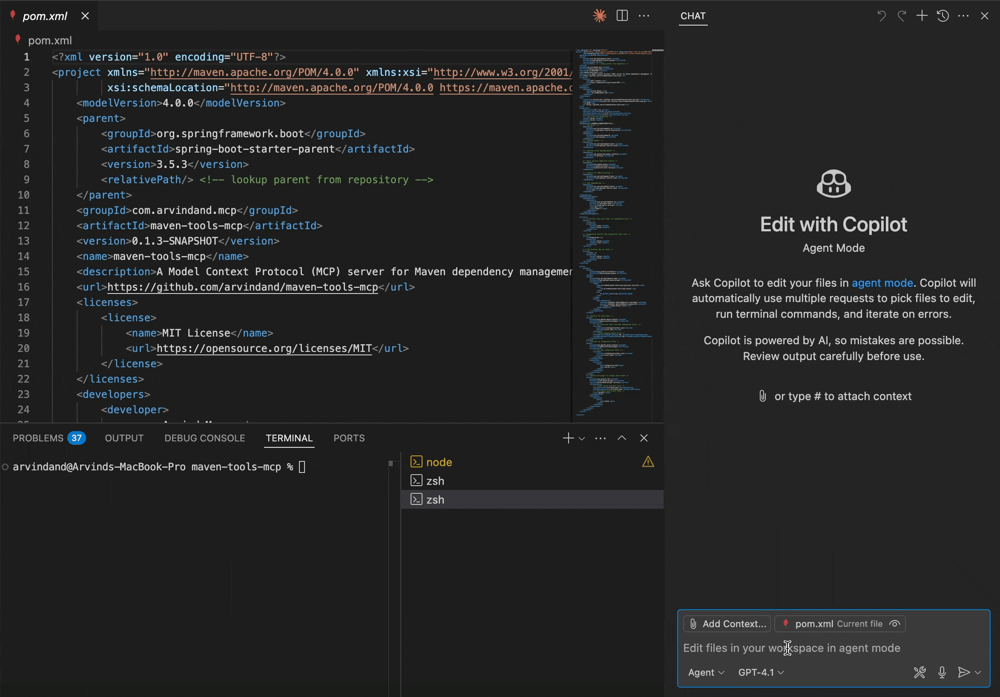

# Maven Tools MCP Server

[](https://openjdk.java.net/)
[](https://spring.io/projects/spring-boot)
[](https://spring.io/projects/spring-ai)
[](https://modelcontextprotocol.io/)
[](LICENSE)
[](https://github.com/arvindand/maven-tools-mcp/releases)
[](https://hub.docker.com/r/arvindand/maven-tools-mcp)
[](https://hub.docker.com/r/arvindand/maven-tools-mcp)
[](https://github.com/arvindand/maven-tools-mcp/stargazers)

Maven Tools MCP Server gives MCP-capable clients a practical way to inspect JVM dependencies using live Maven Central data.

It is built for developers and agents that need more than a plain version lookup: stability filtering, upgrade comparisons, dependency health signals, license data, CVE checks, and optional documentation lookups through Context7.



## What It Helps With

Use Maven Tools MCP when you want to:

- check the latest stable version of a library without leaving your editor
- compare your current dependency set against what is available now
- plan upgrades with major/minor/patch context
- audit a project for stale, risky, or weakly maintained dependencies
- give an AI assistant structured, current dependency metadata instead of making it scrape docs or web pages
- resolve a whole `pom.xml` into per-dependency effective versions — walking the parent chain, applying `<dependencyManagement>`, importing BOMs — without actually building the project (useful in CI pre-checks, dependency-update PRs, multi-module monorepos, and any project where bumping a library means bumping a BOM instead)
- get a deterministic, applyable upgrade plan that a non-LLM agent can execute in one round-trip, with majors / conflicts / explicit overrides separated out for human or LLM judgement

This project works with any JVM build tool that relies on Maven Central. The inputs are standard Maven coordinates, so the same data applies to Maven, Gradle, SBT, and Mill projects.

## Why It Matters

This project is most useful when a plain package search is not enough.

- it gives MCP clients structured dependency data instead of making them scrape web pages
- it keeps upgrade checks grounded in current Maven Central metadata
- it adds stability, age, CVE, and license signals in one place
- it works well alongside agent workflows that need dependency facts before they edit code or open PRs

## Emerging Use Case

One of the more interesting uses of this project is agent-driven dependency maintenance.

The core server does not open PRs by itself, but it gives an agent enough current dependency context to make safer update decisions than a blind version-bump workflow. The `recommend_pom_upgrades` tool was built for exactly that shape: a non-LLM agent hands it a raw `pom.xml`, applies every `deterministic_actions[]` entry as a one-line `<version>` edit (parent block and dep block both handled), and surfaces `needs_attention[]` for a human or LLM to review separately. No per-coordinate fan-out, no Maven XML parsing in agent code, and no recommendations the agent can't actually apply — transitively-managed BOMs are filtered out because the caller has no `<version>` to bump.

This repository's own weekly self-update flow is the clearest example: GitHub Actions orchestrates the run, one MCP call returns the action list, the agent applies the diffs, and the result is a reviewable PR. Major-upgrade review is the only path that asks Copilot for judgement and migration framing.

That is also why the dogfooding setup matters beyond this repository. It demonstrates, in a small and concrete way, the same shape that broader GitHub Agentic Workflows can build on: a workflow orchestrator, structured tool output for deterministic edits, an AI worker only where judgement is useful, and a human-reviewed change at the end.

## Quick Start

### Claude Desktop

Add this to your Claude Desktop config:

```json
{
  "mcpServers": {
    "maven-tools": {
      "command": "docker",
      "args": ["run", "-i", "--rm", "arvindand/maven-tools-mcp:latest"]
    }
  }
}
```

### VS Code + GitHub Copilot

Create `.vscode/mcp.json` in your workspace:

```json
{
  "servers": {
    "maven-tools": {
      "type": "stdio",
      "command": "docker",
      "args": ["run", "-i", "--rm", "arvindand/maven-tools-mcp:latest"]
    }
  }
}
```

### Image Variants

| Tag | Transport | Context7 | Best For |
|-----|-----------|----------|----------|
| `:latest` | STDIO | Yes | Default desktop MCP usage |
| `:latest-noc7` | STDIO | No | Networks where Context7 is blocked or not wanted |
| `:latest-http` | HTTP | Yes | Streamable HTTP clients and sidecar workflows |

`CONTEXT7_API_KEY` is optional. Most setups can start without it. If your environment requires Context7 auth, or you want to avoid anonymous limits, pass it through Docker with `-e CONTEXT7_API_KEY`.

For fuller setup guidance, including JAR/native usage, Docker Compose, and environment notes, see [`docs/setup.md`](docs/setup.md).

## Core Tools

The server exposes 11 MCP tools.

### Maven intelligence tools

| Tool | What It Does |
|------|---------------|
| `get_latest_version` | Find the latest version with stability-aware selection |
| `check_version_exists` | Verify a specific version and classify its stability |
| `check_multiple_dependencies` | Bulk lookup for dependency coordinates |
| `compare_dependency_versions` | Compare current versions against available upgrades |
| `analyze_dependency_age` | Classify how old a dependency is |
| `analyze_release_patterns` | Look at release cadence and maintenance signals |
| `analyze_project_health` | Run a broader dependency health audit |
| `analyze_pom_dependencies` | POM-aware: resolve effective versions from raw pom.xml, classify as `EXPLICIT` / `MANAGED` / `EXPLICIT_OVERRIDE`, surface multi-BOM conflicts |
| `recommend_pom_upgrades` | POM-aware: returns deterministic `<version>` edits (explicit + BOM bumps) for an agent to apply, plus a `needs_attention` list of majors / conflicts / overrides for human or LLM review |

### Context7 documentation tools

| Tool | What It Does |
|------|---------------|
| `resolve-library-id` | Find a documentation library identifier |
| `query-docs` | Fetch docs by Context7 library ID |

For parameters, examples, and tool-by-tool notes, see [`docs/tools.md`](docs/tools.md).

### POM-aware dependency analysis

Two tools take a whole POM (raw XML) rather than a single coordinate. Both walk the parent chain, apply `<dependencyManagement>`, resolve `<scope>import</scope>` BOMs against Maven Central, scope `${project.version}` per-POM so an imported BOM's placeholders resolve to that BOM's version (not the importer's), and accept an optional `sideloadedPoms` bundle for monorepo siblings / unreleased parents.

- **`analyze_pom_dependencies`** — returns each declared dep with effective version + classification (`EXPLICIT` / `MANAGED` / `EXPLICIT_OVERRIDE`) + managing BOM coordinate + any multi-BOM `conflicts`. Use when you want raw analysis ("what does my POM actually resolve to?").
- **`recommend_pom_upgrades`** — builds on the analyzer and returns two lists: `deterministic_actions` (mechanical `<version>` edits — `explicit_bump` for declared deps, `bom_bump` for user-controllable BOMs where a newer minor/patch exists) and `needs_attention` (majors, multi-BOM conflicts, and explicit overrides, each carrying the Maven Central latest so an LLM has full context in one round-trip). Use for "what can I safely bump?" workflows.

Upgrade recommendations are scoped to BOMs the caller can actually edit in their own POM — the direct `<parent>` and root-level `<dependencyManagement>` imports. Transitively-imported BOMs (e.g., `jackson-bom` inherited through `spring-boot-dependencies`) are silently skipped because there's no `<version>` for an agent to bump; their upgrades surface via whichever user-controllable knob brings them in. The split matters: a non-LLM agent never needs to call `compare_dependency_versions` per-dep or parse Maven XML — one `recommend_pom_upgrades` call returns everything mechanical, and the LLM review path picks up everything that needs judgment.

## Example

A common prompt in Copilot or Claude is:

> Check all latest versions of the dependencies in my `pom.xml` and call out anything risky.

A good response from this server gives the client structured information such as:

- current version vs latest version
- whether the upgrade is major, minor, or patch
- whether the newest release is stable
- whether the dependency looks fresh, aging, or stale
- whether there are known CVEs or license concerns worth noticing

That keeps the workflow grounded in live repository data instead of guesswork.

For broader questions like "which library should I choose?", the useful pattern is: let the model use Maven Tools MCP for current coordinates, version/stability signals, and upgrade context, then combine that with Context7 docs (available through the default image's exposed tools) and, when needed, client-side web search for ecosystem context that this server does not provide on its own.

For more prompt examples, see [`docs/examples.md`](docs/examples.md). There is also a [`maven-tools` skill in the separate `agent-skills` repository](https://github.com/arvindand/agent-skills/tree/main/skills/maven-tools) that gives agents general guidance for using Maven Tools MCP effectively across varied use cases, while the local prompt examples and dogfooding agent define more specific paths.

## Dogfooding

This repository runs a weekly self-update workflow that uses a local Python agent against its own `pom.xml` and opens a reviewable PR for safe dependency updates. The agent hands the raw POM to `recommend_pom_upgrades` and applies the returned `deterministic_actions[]` directly — no per-coordinate fan-out, no XML parsing in Python. Manual major-review runs are the only mode that routes through the GitHub Copilot SDK.

That flow is documented in [`docs/dogfooding.md`](docs/dogfooding.md), including:

- the GitHub Actions workflow
- the agent subproject under `agents/copilot-maven-tools-agent/`
- direct MCP minor/patch mode vs Copilot-backed major-review mode
- required `COPILOT_BOT_PAT` setup for PR creation and major-review runs
- manual trigger instructions

## FAQ

- **Does this replace Renovate or Dependabot?** For Maven Central-based JVM projects, it can. Maven Tools MCP is the dependency intelligence layer, and the replacement behavior comes from the agent workflow built on top of it. In this repository, the weekly self-update workflow already replaces routine blind update PRs for safe minor and patch upgrades through direct MCP calls, while leaving major upgrades for Copilot-assisted manual review.
- **Does it work offline?** Not fully. Uncached queries need network access to Maven Central.
- **Does it work for Gradle or other JVM build tools?** Yes, as long as the project depends on libraries that are resolved through Maven Central coordinates.

For a few more usage notes, see the FAQ section in [`docs/examples.md`](docs/examples.md#faq).

## Acknowledgements

The effective POM resolver under `com.arvindand.mcp.maven.pom` follows the resolution
shape of [maxxq-org/maxxq-maven](https://github.com/maxxq-org/maxxq-maven) (MIT,
Guy Chauliac), scoped here to declared-dep resolution. See [`NOTICE`](NOTICE).

## More Docs

- [`docs/setup.md`](docs/setup.md) - installation, client configuration, image variants, build-from-source options
- [`docs/tools.md`](docs/tools.md) - full tool catalog, parameters, and response behavior
- [`docs/examples.md`](docs/examples.md) - practical prompts, advanced use cases, reusable commands, and FAQ notes
- [`docs/dogfooding.md`](docs/dogfooding.md) - weekly self-update workflow and agent integration
- [`docs/troubleshooting.md`](docs/troubleshooting.md) - common environment issues and fixes
- [`docs/architecture.md`](docs/architecture.md) - design principles, transport/runtime options, and technical notes
- [`CORPORATE-CERTIFICATES.md`](CORPORATE-CERTIFICATES.md) - custom CA certificate support for locked-down networks

## Further Reading

- [How I Connected Claude to Maven Central (and Why You Should Too)](https://dev.to/arvindand/how-i-connected-claude-to-maven-central-and-why-you-should-too-2clo)
- [Guided Delegation: Adding Context7 Documentation to My Maven Tools MCP Server](https://dev.to/arvindand/guided-delegation-adding-context7-documentation-to-my-maven-tools-mcp-server-572l)

## Contributing

If you want to build or test locally, start with [`docs/setup.md`](docs/setup.md#build-from-source) and the helper scripts in [`build/`](build/).

Project history and release notes live in [`CHANGELOG.md`](CHANGELOG.md).

## License

This project is licensed under the MIT License. See [`LICENSE`](LICENSE).

## Author

Arvind Menon

- GitHub: [@arvindand](https://github.com/arvindand)
