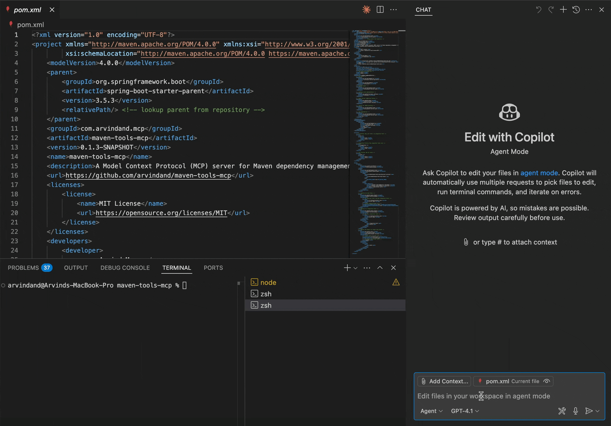

# Maven Tools MCP Server

[](https://openjdk.java.net/)
[](https://spring.io/projects/spring-boot)
[](https://spring.io/projects/spring-ai)
[](https://modelcontextprotocol.io/)
[](LICENSE)
[](https://github.com/arvindand/maven-tools-mcp/releases)
[](https://hub.docker.com/r/arvindand/maven-tools-mcp)
[](https://hub.docker.com/r/arvindand/maven-tools-mcp)
[](https://github.com/arvindand/maven-tools-mcp/stargazers)

Maven Tools MCP Server gives MCP-capable clients a practical way to inspect JVM dependencies using live Maven Central data.

It is built for developers and agents that need more than a plain version lookup: stability filtering, upgrade comparisons, dependency health signals, license data, CVE checks, and optional documentation lookups through Context7.



## What It Helps With

- **Version checks:** find stable releases and compare upgrades with major/minor/patch context.
- **Dependency audits:** inspect age, release cadence, known vulnerabilities, and license data.
- **POM analysis:** resolve declared dependency versions through parents and BOMs without building the project.
- **Upgrade planning:** get structured edits an agent can validate and apply, with major upgrades, conflicts, and overrides flagged for review.
- **Documentation:** look up library docs through the optional Context7 tools.

Coordinate-based tools work with Maven, Gradle, SBT, and Mill projects. The POM analysis and upgrade-planning tools take Maven `pom.xml` files.

## Quick Start

**Prerequisite:** Docker installed and running. No local Java installation is required. For a Docker-free setup, see [building and running the JAR](docs/setup.md#build-from-source).

### Claude Desktop

Add the `maven-tools` entry to your Claude Desktop config (see [config file locations](docs/setup.md#claude-desktop)):

```json
{
  "mcpServers": {
    "maven-tools": {
      "command": "docker",
      "args": ["run", "-i", "--rm", "arvindand/maven-tools-mcp:latest"]
    }
  }
}
```

### VS Code + GitHub Copilot

Add the following server to `.vscode/mcp.json` in your workspace:

```json
{
  "servers": {
    "maven-tools": {
      "type": "stdio",
      "command": "docker",
      "args": ["run", "-i", "--rm", "arvindand/maven-tools-mcp:latest"]
    }
  }
}
```

### Image Variants

| Tag | Transport | Context7 | Best For |
|-----|-----------|----------|----------|
| `:latest` | STDIO | Yes | Default desktop MCP usage |
| `:latest-noc7` | STDIO | No | Networks where Context7 is blocked or not wanted |
| `:latest-http` | HTTP | Yes | Streamable HTTP clients and sidecar workflows |

`CONTEXT7_API_KEY` is optional. Most setups can start without it. If your environment requires Context7 auth, or you want to avoid anonymous limits, pass it through Docker with `-e CONTEXT7_API_KEY`.

For fuller setup guidance, including JAR and native-container usage, Docker Compose, and environment notes, see [`docs/setup.md`](docs/setup.md).

## Available Tools

The default image exposes 11 MCP tools; `-noc7` exposes the 9 core tools.

### Maven intelligence tools

| Tool | What It Does |
|------|---------------|
| `get_latest_version` | Find the latest version with stability-aware selection |
| `check_version_exists` | Verify a specific version and classify its stability |
| `check_multiple_dependencies` | Bulk lookup for dependency coordinates |
| `compare_dependency_versions` | Compare current versions against available upgrades |
| `analyze_dependency_age` | Classify how old a dependency is |
| `analyze_release_patterns` | Look at release cadence and maintenance signals |
| `analyze_project_health` | Run a broader dependency health audit |
| `analyze_pom_dependencies` | Resolve declared dependency versions, identify their source, and surface BOM conflicts |
| `recommend_pom_upgrades` | Produce actionable POM upgrade recommendations and flag changes needing review |

### Context7 documentation tools

| Tool | What It Does |
|------|---------------|
| `resolve_library_id` | Find a documentation library identifier |
| `query_docs` | Fetch docs by Context7 library ID |

For parameters, examples, and tool-by-tool notes, see [`docs/tools.md`](docs/tools.md).

### POM-aware dependency analysis

Both POM tools use **Apache Maven Model Builder** for parent inheritance, properties, and dependency management, including imported BOMs. They accept raw POM XML and an optional `sideloadedPoms` bundle for unreleased parents or sibling modules.

- **`analyze_pom_dependencies`** returns effective versions, classifies declarations as `EXPLICIT`, `MANAGED`, or `EXPLICIT_OVERRIDE`, and identifies managing BOMs and conflicts.
- **`recommend_pom_upgrades`** returns `deterministicActions` for mechanical edits and `needsAttention` for major upgrades, BOM conflicts, and explicit overrides. Actions identify the version field or property to edit in the input POM.

Recommendations cover editable parent/BOM versions, explicit dependencies, root dependency-management entries, and direct build/plugin dependencies. Declarations without an unambiguous edit location in the input POM are skipped. The server returns recommendations; the client or agent validates and applies them.

Analysis covers declared dependencies, not the full transitive dependency graph. Profile activation is limited to active-by-default profiles. See [POM analysis details and limits](docs/tools.md#pom-aware-analysis).

## Example

A common prompt in Copilot or Claude is:

> Check all latest versions of the dependencies in my `pom.xml` and call out anything risky.

The client can combine tool results to report:

- current version vs latest version
- whether the upgrade is major, minor, or patch
- whether the newest release is stable
- whether the dependency looks fresh, aging, or stale
- whether there are known CVEs or license concerns worth noticing

For broader questions like "which library should I choose?", combine Maven metadata with Context7 documentation and client-side web search for ecosystem context.

See [more prompt examples](docs/examples.md) or the [`maven-tools` agent skill](https://github.com/arvindand/agent-skills/tree/main/skills/maven-tools) for guidance on choosing and combining tools.

## Dogfooding

This repository uses its own tools in a weekly dependency-update workflow. A Python agent sends the POM to `recommend_pom_upgrades`, validates and applies minor/patch actions, and opens a PR for review. Its XML editor checks current versions and preserves formatting. Manual major-upgrade reviews use the GitHub Copilot SDK; routine updates do not require an LLM.

See [the dogfooding guide](docs/dogfooding.md) for the agent, GitHub Actions workflow, credentials, and manual triggers.

## FAQ

- **Does this replace Renovate or Dependabot?** The server provides dependency analysis and upgrade recommendations. File edits, testing, scheduling, and PR creation require a separate agent or workflow. The [included agent](docs/dogfooding.md) demonstrates this for Maven POM updates.
- **Does it work offline?** Not fully. Uncached metadata queries need access to Maven Central or your configured repository. Vulnerability checks and Context7 documentation also use external services.
- **Does it parse Gradle, SBT, or Mill build files?** No. Use their dependencies' Maven coordinates with the coordinate-based tools; whole-file analysis accepts Maven POM XML.

For a few more usage notes, see the FAQ section in [`docs/examples.md`](docs/examples.md#faq).

## Acknowledgements

The effective POM resolver under `com.arvindand.mcp.maven.pom` follows the resolution
shape of [maxxq-org/maxxq-maven](https://github.com/maxxq-org/maxxq-maven) (MIT,
Guy Chauliac), scoped here to declared-dep resolution. See [`NOTICE`](NOTICE).

## More Docs

- [`docs/setup.md`](docs/setup.md) - installation, client configuration, image variants, build-from-source options
- [`docs/tools.md`](docs/tools.md) - full tool catalog, parameters, and response behavior
- [`docs/examples.md`](docs/examples.md) - practical prompts, advanced use cases, reusable commands, and FAQ notes
- [`docs/dogfooding.md`](docs/dogfooding.md) - weekly self-update workflow and agent integration
- [`docs/troubleshooting.md`](docs/troubleshooting.md) - common environment issues and fixes
- [`docs/architecture.md`](docs/architecture.md) - design principles, transport/runtime options, and technical notes
- [`CORPORATE-CERTIFICATES.md`](CORPORATE-CERTIFICATES.md) - custom CA certificate support for locked-down networks

## Further Reading

- [How I Connected Claude to Maven Central (and Why You Should Too)](https://dev.to/arvindand/how-i-connected-claude-to-maven-central-and-why-you-should-too-2clo)
- [Guided Delegation: Adding Context7 Documentation to My Maven Tools MCP Server](https://dev.to/arvindand/guided-delegation-adding-context7-documentation-to-my-maven-tools-mcp-server-572l)

## Contributing

If you want to build or test locally, start with [`docs/setup.md`](docs/setup.md#build-from-source) and the helper scripts in [`build/`](build/).

Project history and release notes live in [`CHANGELOG.md`](CHANGELOG.md).

## License

This project is licensed under the MIT License. See [`LICENSE`](LICENSE).

## Author

Arvind Menon

- GitHub: [@arvindand](https://github.com/arvindand)
